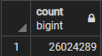

# Movies ETL

## Challenge Overview
You are to create an automated pipeline that takes in new data, performs the appropriate transformations, and loads the data into existing tables. You will create one function that takes in three files - Wikipedia data, Kaggle metadata, and the MovieLens rating data - and performs the ETL process by adding the data to a PostgreSQL database.

## Resources
 - Data Source: wikipedia-movies.json, movies_metadata.csv, ratings.csv (not uploaded as file is too large)
 - Software: PostgreSQl 12.4, Jupyter Notebook 6.0.3, Python 3.7.7, Visual Studio Code 1.47.2

## Challenge Summary
By running a query to confirm the correct amount of rows in each table, we can check if we have successfully loaded the data into PostgreSQL.

Count of Rows for Movies Table | Count of Rows for Ratings Table
:-----------------------------:|:-------------------------------:
 | 